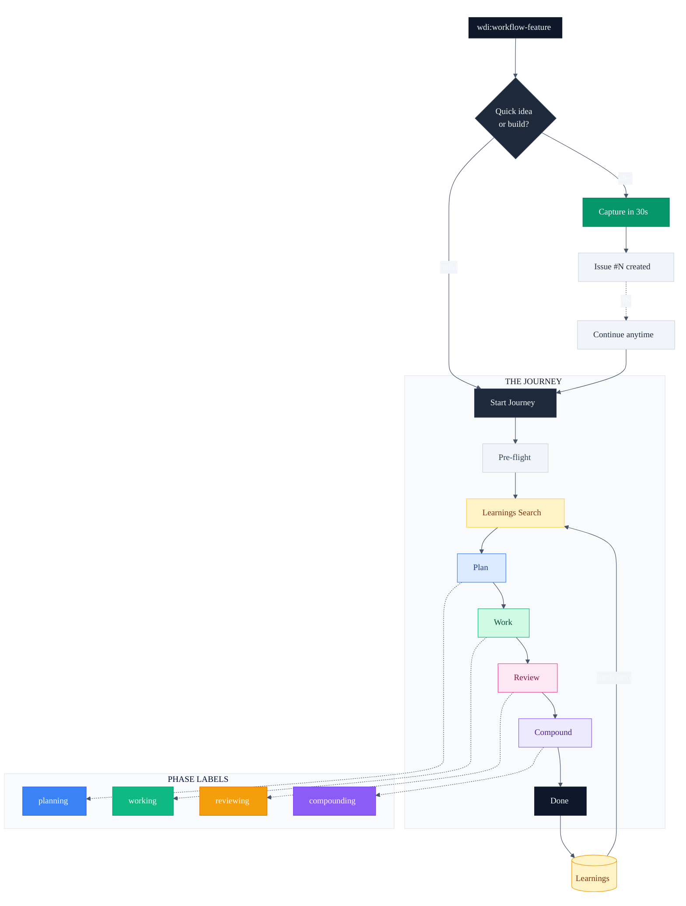
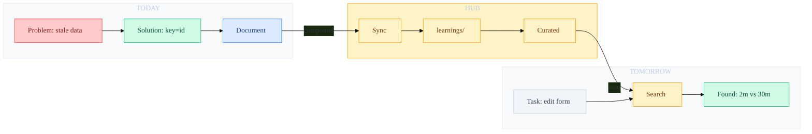
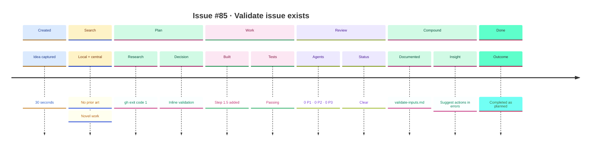
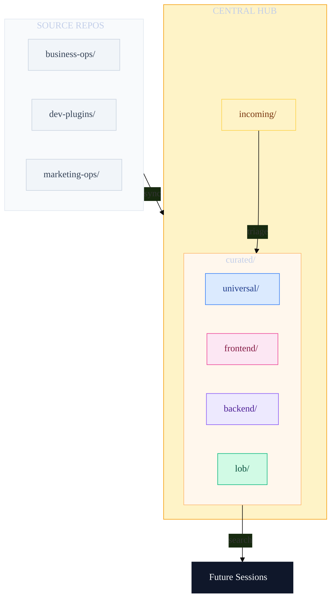
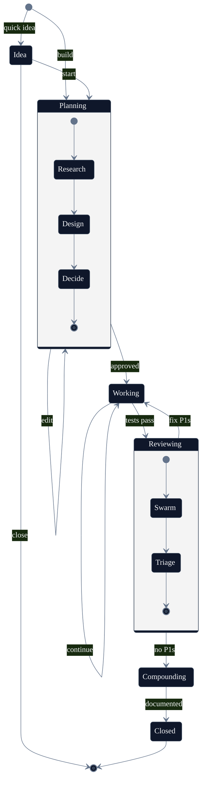
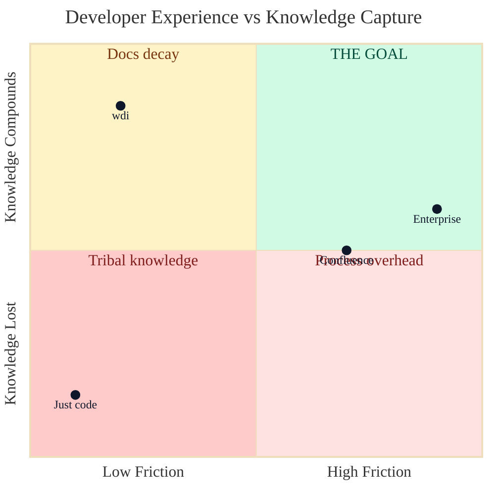

# Feature Development Workflow

> **One command. Complete journey. Knowledge compounds.**

## The Big Picture



---

## The Compounding Flywheel

Every feature you ship makes the next one easier.



---

## What the Issue Looks Like

The GitHub issue becomes a living document of the journey.



---

## The Review Swarm

12+ specialized agents catch what humans miss.

```mermaid
%%{init: {'theme': 'base', 'themeVariables': { 'primaryColor': '#0f172a', 'fontFamily': 'ui-monospace, monospace'}}}%%
flowchart TB
    subgraph code [" "]
        changes["Your Changes"]
    end

    changes --> review[["workflows:review"]]

    subgraph agents ["  12+ AGENTS IN PARALLEL  "]
        direction LR
        a1["Architecture"]
        a2["Security"]
        a3["Performance"]
        a4["Simplicity"]
        a5["Data"]
        a6["Patterns"]
        a7["Rails"]
        a8["Python"]
        a9["TypeScript"]
        a10["Deploy"]
        a11["Agent"]
        a12["..."]
    end

    review --> agents

    agents --> findings["Prioritized Findings"]

    subgraph priority ["  TRIAGE  "]
        p1["P1 Blocking"]
        p2["P2 Important"]
        p3["P3 Consider"]
    end

    findings --> priority
    priority --> issues["Issues Created"]

    style code fill:none,stroke:none
    style changes fill:#f1f5f9,stroke:#cbd5e1,color:#334155
    style review fill:#0f172a,stroke:#0f172a,color:#f8fafc
    style agents fill:#fce7f3,stroke:#ec4899
    style a1 fill:#fce7f3,stroke:#f9a8d4,color:#831843
    style a2 fill:#fce7f3,stroke:#f9a8d4,color:#831843
    style a3 fill:#fce7f3,stroke:#f9a8d4,color:#831843
    style a4 fill:#fce7f3,stroke:#f9a8d4,color:#831843
    style a5 fill:#fce7f3,stroke:#f9a8d4,color:#831843
    style a6 fill:#fce7f3,stroke:#f9a8d4,color:#831843
    style a7 fill:#fce7f3,stroke:#f9a8d4,color:#831843
    style a8 fill:#fce7f3,stroke:#f9a8d4,color:#831843
    style a9 fill:#fce7f3,stroke:#f9a8d4,color:#831843
    style a10 fill:#fce7f3,stroke:#f9a8d4,color:#831843
    style a11 fill:#fce7f3,stroke:#f9a8d4,color:#831843
    style a12 fill:#fce7f3,stroke:#f9a8d4,color:#831843
    style findings fill:#f1f5f9,stroke:#cbd5e1,color:#334155
    style priority fill:#f8fafc,stroke:#e2e8f0
    style p1 fill:#fecaca,stroke:#ef4444,color:#7f1d1d
    style p2 fill:#fef3c7,stroke:#f59e0b,color:#78350f
    style p3 fill:#dbeafe,stroke:#3b82f6,color:#1e3a8a
    style issues fill:#d1fae5,stroke:#10b981,color:#064e3b
```



---

## Learnings Taxonomy

Knowledge organized for instant discovery.



---

## State Machine

How issues flow through the system.



---

## Quick Reference

| Command | Description |
|---------|-------------|
| `wdi:workflow-feature` | Start new |
| `wdi:workflow-feature #45` | Continue issue |
| `wdi:workflow-feature --yes` | Auto-continue |
| `wdi:workflow-feature --plan` | Plan only |

---

## Real Example

[Issue #85](https://github.com/whitedoeinn/dev-plugins-workflow/issues/85) shows the complete journey.

```
#85: Validate issue exists
  Body      Problem, Solution, Plan
  Search    No prior art found
  Plan      gh returns exit code 1
  Work      Step 1.5 added, tests passing
  Review    0 P1, 0 P2, 0 P3
  Compound  Learnings documented
  Closed    Completed as planned
```

---

## Why This Matters



**The sweet spot:** Low friction, high knowledge retention.

---

## Get Started

```bash
curl -sSL https://raw.githubusercontent.com/whitedoeinn/dev-plugins-workflow/main/install.sh | bash
```

Then run:
```
wdi:workflow-feature
```

---

<p align="center">
  <strong>One command. Complete journey. Knowledge compounds.</strong>
  <br><br>
  <a href="https://github.com/whitedoeinn/dev-plugins-workflow">GitHub</a> ·
  <a href="https://github.com/whitedoeinn/dev-plugins-workflow/issues/85">Example</a> ·
  <a href="https://github.com/whitedoeinn/learnings">Learnings</a>
</p>
