# Feature Development Workflow

> **One command. Complete journey. Knowledge compounds.**

## The Big Picture

```mermaid
%%{init: {'theme': 'base', 'themeVariables': { 'primaryColor': '#6366f1', 'primaryTextColor': '#fff', 'primaryBorderColor': '#4f46e5', 'lineColor': '#94a3b8', 'secondaryColor': '#f0fdf4', 'tertiaryColor': '#fef3c7'}}}%%
flowchart TB
    subgraph entry ["🚀 START HERE"]
        cmd["/wdi:workflow-feature"]
    end

    cmd --> choice{"What do you<br/>want to do?"}

    choice -->|"💡 Quick idea"| quick["✨ Capture thought<br/>One sentence<br/>30 seconds"]
    choice -->|"🔨 Build something"| full["Full Workflow"]

    quick --> issue["📋 GitHub Issue #N<br/>label: idea"]
    issue -.->|"Continue anytime"| continue["/wdi:workflow-feature #N"]
    continue --> full

    subgraph workflow ["THE JOURNEY"]
        direction TB
        full --> preflight["🛫 Pre-flight<br/>Validate environment"]
        preflight --> search["🔍 Learnings Search<br/>Surface prior solutions"]
        search --> plan["📐 Plan<br/>Research → Design → Decide"]
        plan --> work["⚡ Work<br/>Build with quality gates"]
        work --> review["🔬 Review<br/>12+ agents in parallel"]
        review --> compound["🧠 Compound<br/>Document learnings"]
        compound --> done["✅ Complete"]
    end

    subgraph labels ["PHASE VISIBILITY"]
        l1["🔵 phase:planning"]
        l2["🟢 phase:working"]
        l3["🟡 phase:reviewing"]
        l4["🟣 phase:compounding"]
    end

    plan -.-> l1
    work -.-> l2
    review -.-> l3
    compound -.-> l4

    done --> solutions[("📚 docs/solutions/<br/>Learnings")]
    solutions -->|"Feeds next session"| search

    style cmd fill:#6366f1,stroke:#4f46e5,color:#fff
    style quick fill:#10b981,stroke:#059669,color:#fff
    style issue fill:#f0fdf4,stroke:#86efac
    style done fill:#10b981,stroke:#059669,color:#fff
    style solutions fill:#fef3c7,stroke:#fcd34d
    style l1 fill:#1D76DB,color:#fff
    style l2 fill:#0E8A16,color:#fff
    style l3 fill:#FBCA04,color:#000
    style l4 fill:#6F42C1,color:#fff
```



---

## The Compounding Flywheel

Every feature you ship makes the next one easier.

```mermaid
%%{init: {'theme': 'base', 'themeVariables': { 'primaryColor': '#8b5cf6'}}}%%
flowchart LR
    subgraph session1 ["SESSION 1"]
        direction TB
        p1["😤 Problem:<br/>Form shows stale data"]
        s1["💡 Solution:<br/>Use key={id}"]
        d1["📝 Document it"]
    end

    subgraph central ["LEARNINGS HUB"]
        direction TB
        sync["🔄 Sync"]
        repo["whitedoeinn/learnings"]
        curated["📚 Curated by topic"]
    end

    subgraph session2 ["SESSION 2"]
        direction TB
        p2["🤔 New task:<br/>Add edit form"]
        search2["🔍 Learnings Search"]
        found["✨ Found it!<br/>2 min vs 30 min"]
    end

    p1 --> s1 --> d1
    d1 -->|"/workflows:compound"| sync
    sync --> repo --> curated
    curated -->|"Auto-surfaces"| search2
    p2 --> search2 --> found

    style p1 fill:#fecaca,stroke:#f87171
    style s1 fill:#bbf7d0,stroke:#4ade80
    style d1 fill:#e0e7ff,stroke:#a5b4fc
    style found fill:#bbf7d0,stroke:#4ade80
    style repo fill:#fef3c7,stroke:#fcd34d
```



---

## What the Issue Looks Like

The GitHub issue becomes a living document of the journey.


---

## The Review Swarm

12+ specialized agents catch what humans miss.

```mermaid
%%{init: {'theme': 'base', 'themeVariables': { 'primaryColor': '#6366f1'}}}%%
flowchart TB
    subgraph code ["YOUR CODE"]
        changes["📝 Changes"]
    end

    changes --> review["🔬 /workflows:review"]

    subgraph agents ["PARALLEL AGENT SWARM"]
        direction LR
        a1["🏛️ Architecture"]
        a2["🔒 Security"]
        a3["⚡ Performance"]
        a4["🎯 Simplicity"]
        a5["💾 Data Integrity"]
        a6["🔄 Patterns"]
        a7["🛤️ Rails"]
        a8["🐍 Python"]
        a9["📘 TypeScript"]
        a10["🚀 Deployment"]
        a11["🤖 Agent-Native"]
        a12["📊 More..."]
    end

    review --> agents

    agents --> findings["📋 Prioritized Findings"]

    subgraph priority ["PRIORITY TRIAGE"]
        p1["🔴 P1: Blocking"]
        p2["🟡 P2: Important"]
        p3["🔵 P3: Nice-to-have"]
    end

    findings --> priority
    priority --> issues["🎫 GitHub Issues Created"]

    style changes fill:#e0e7ff,stroke:#a5b4fc
    style review fill:#6366f1,stroke:#4f46e5,color:#fff
    style p1 fill:#fecaca,stroke:#f87171
    style p2 fill:#fef3c7,stroke:#fcd34d
    style p3 fill:#dbeafe,stroke:#93c5fd
```



---

## Learnings Taxonomy

Knowledge organized for instant discovery.

```mermaid
%%{init: {'theme': 'base'}}%%
flowchart TB
    subgraph repos ["SOURCE REPOS"]
        r1["📦 business-ops<br/>docs/solutions/"]
        r2["📦 dev-plugins<br/>docs/solutions/"]
        r3["📦 marketing-ops<br/>docs/solutions/"]
    end

    repos -->|"./scripts/sync-all.sh"| central

    subgraph central ["CENTRAL: whitedoeinn/learnings"]
        direction TB
        incoming["📥 incoming/<br/>Raw sync"]
        incoming -->|"Triage"| curated

        subgraph curated ["📚 curated/"]
            universal["🌍 universal/<br/>Any stack"]
            frontend["⚛️ frontend/<br/>React, CSS, UI"]
            backend["💎 backend/<br/>Ruby, Rails, APIs"]
            lob["🏢 lob/<br/>Business domains"]
        end
    end

    curated -->|"Learnings Search"| sessions["🔮 Future Sessions"]

    style incoming fill:#fef3c7,stroke:#fcd34d
    style universal fill:#e0e7ff,stroke:#a5b4fc
    style frontend fill:#dbeafe,stroke:#93c5fd
    style backend fill:#fce7f3,stroke:#f9a8d4
    style lob fill:#d1fae5,stroke:#6ee7b7
```



---

## State Machine

How issues flow through the system.


---

## Quick Reference

| Command | What Happens |
|---------|--------------|
| `/wdi:workflow-feature` | Start new (asks: quick idea or build?) |
| `/wdi:workflow-feature #45` | Continue existing issue |
| `/wdi:workflow-feature --yes` | Auto-continue through phases |
| `/wdi:workflow-feature --plan` | Stop after planning |

---

## Real Example

**See the workflow in action:** [Issue #85](https://github.com/whitedoeinn/dev-plugins-workflow/issues/85)

A complete journey from idea to shipped feature, with every phase documented.

```
#85: Validate issue exists in continue mode
├── [Body] Problem, Solution, Plan
├── [Comment] Learnings Search - "No prior art found"
├── [Comment] Plan - Research: gh returns exit code 1...
├── [Comment] Work - Added Step 1.5, tests passing
├── [Comment] Review - 0 P1s, 0 P2s, 0 P3s
├── [Comment] Compound - Learnings documented
└── [Closed] ✓ Completed as planned, commit 8ce4fc7
```

---

## Why This Matters

```mermaid
%%{init: {'theme': 'base'}}%%
quadrantChart
    title Developer Experience vs Knowledge Capture
    x-axis Low Friction --> High Friction
    y-axis Knowledge Lost --> Knowledge Compounds
    quadrant-1 "🎯 THE GOAL"
    quadrant-2 "Traditional docs"
    quadrant-3 "No process"
    quadrant-4 "Heavy process"
    "wdi workflow": [0.2, 0.85]
    "Confluence": [0.7, 0.5]
    "Just code": [0.1, 0.15]
    "Jira + PRs + Docs": [0.9, 0.6]
```



**We're in the sweet spot:** Low friction, high knowledge retention.

---

## Get Started

```bash
# Install
curl -sSL https://raw.githubusercontent.com/whitedoeinn/dev-plugins-workflow/main/install.sh | bash

# Your first feature
/wdi:workflow-feature
```

---

<p align="center">
  <strong>One command. Complete journey. Knowledge compounds.</strong>
  <br><br>
  <a href="https://github.com/whitedoeinn/dev-plugins-workflow">GitHub</a> •
  <a href="https://github.com/whitedoeinn/dev-plugins-workflow/issues/85">Real Example</a> •
  <a href="https://github.com/whitedoeinn/learnings">Learnings Repo</a>
</p>
